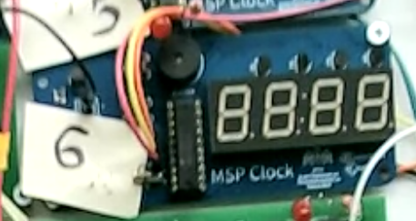

# RTU MSP430 clock

This project contains source code to program MSP430 based clock device. The code was developed in scope of laboratory work in electronics as an attempt to improve the existing implementation proposed in the work instructions.

# How to use the clock

There are two buttons present on the clock - top button and bottom button. There are also 4 modes that user can cycle through using the top button:
1. display `minutes:seconds`;
2. display `hours:minutes`;
3. set `hours:minutes`;
4. set alarm `hours:minutes`.

While the first two modes can just display the time, the remaining modes are a bit more interesting.

## Set time mode
While in this mode, the user is able to set current time. To do it, the user can press bottom button to change the value of blinking hours/minutes by one unit. To switch between hours/minutes the user can press and hold the bottom button until the desired part starts blinking. The new time gets set after switching mode using top button press.

## Set alarm clock mode
While in this mode, the user is able to switch between `AL:oF`/`AL:on` sates (alarm on/alarm off respectively). To do this, the user can press the bottom button. To actually set the time, the user can long press bottom button and then set up the alarm time just like in set time mode. The new time gets set after switching mode using top button press.

## Alarm
If alarm goes off, the music will be playing and the indicator is going to blink the alarm time. To disable alarm, the user can press top button and return to previous mode.
